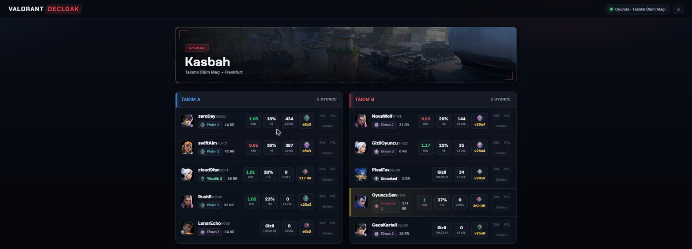
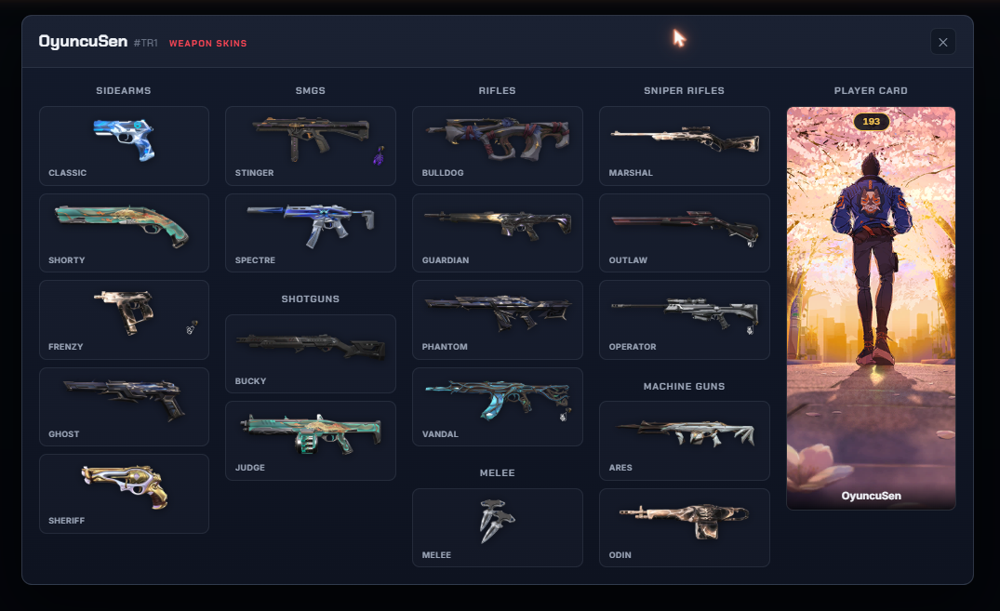

<h5 align="center"> VALORANT DECLOAK</h5>

[![Discord][discord-shield]][discord-url]
[![Downloads][downloads-shield]][downloads-url]

Valorant Decloak shows the names (including hidden/streamer-mode players),
ranks, peak ranks, and stats of the players in your game in a local web panel
while VALORANT is open. The program runs
entirely locally, and the interface is in TR/EN.

---

  <ol>
    <li><a href="#about-the-project">About The Project</a></li>
    <li><a href="#features">Features</a></li>
    <li><a href="#usage">Usage</a></li>
    <li><a href="#contributing">Contributing</a></li>
    <li><a href="#contact">Contact</a></li>
    <li><a href="#acknowledgements">Acknowledgements</a></li>
    <li><a href="#disclaimer">Disclaimer</a></li>
  </ol>

## About The Project

The panel shows every player's rank, peak rank, K/D, headshot %, level, and party
grouping at a glance:

Clicking "Skins" on a player opens their in-match loadout:

## Features

- **Local web panel**: Everything is shown in a native window (webview) that
  opens alongside the game, so there's no need to open a separate browser tab.
  Closing the panel window closes the program as well. If pywebview isn't
  available, the panel automatically falls back to your default browser.
- **Base Turkish interface**: All messages and game modes shown in the panel are in
  Turkish basely but u can change from right bottom.
- Shows rank, peak rank, RR, headshot percentage, win rate, leaderboard
  position, account level, current skin, and Discord Rich Presence, among
  other stats.

## Usage
**VALORANT must be open**.

### Bundled Release:

1) Download [Microsoft Visual C++ Libraries](https://github.com/abbodi1406/vcredist/releases)
2) Download the [release](https://github.com/tcoyemre/valorantdecloak/releases/latest).
3) Extract **all** files.
4) Put your own HenrikDEV API key in `config.json` (if you don't put u cant see stats and names).
5) Run `Decloak.exe`.

### Running from source:

1) Download Python [3.11](https://www.python.org/downloads/release/python-3119/) or [3.10](https://www.python.org/downloads/release/python-31011/), make sure it is added to the PATH. (This is an option on installation.)
2) Download the [source](https://github.com/tcoyemre/valorantdecloak/archive/refs/heads/main.zip).
3) Run **`INSTALL.bat`** file (or use `pip install -r requirements.txt` in the terminal)
4) Run **`START.bat`** file (or use `python main.py` in the terminal)

You can also run `python main.py --config` to open the interactive settings menu.

### Compiling from source code:

1) `pip install cx_Freeze`
2) `python setup.py build`
3) Open the new Build folder and find `Decloak.exe`.

## What about that Tweet?

The [Tweet](https://twitter.com/PlayVALORANT/status/1539728676815642624), which details Riot's API policies

## Contributing

Any contributions you make are **greatly appreciated**.

## Contact

Join the my discord:

[![Discord Banner 2][discord-banner]][discord-url]

## Acknowledgements

- [Valorant-API.com](https://valorant-api.com/)
- [HenrikDEV](https://henrikdev.xyz/)
- [HenrikDEV API KEY](https://api.henrikdev.xyz/dashboard/api-keys/)

## Disclaimer

This project is not affiliated with Riot Games and is not endorsed by Riot Games. Riot Games and all related assets are trademarks or registered trademarks of Riot Games, Inc.

You acknowledge that the risk of using this software is entirely your own.

[discord-shield]: https://img.shields.io/discord/1464955156180242434?color=7289da&label=Support&logo=discord&logoColor=7289da&style=for-the-badge
[discord-url]: https://discord.gg/jbknGqMrN9
[discord-banner]: https://discordapp.com/api/guilds/1464955156180242434/widget.png?style=banner2

[downloads-shield]: https://img.shields.io/github/downloads/tcoyemre/valorantdecloak/total?style=for-the-badge&logo=github
[downloads-url]: https://github.com/tcoyemre/valorantdecloak/releases/latest
